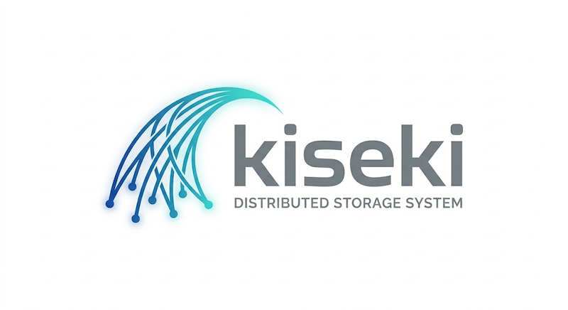

<p align="center">
  
</p>

<p align="center">
  <a href="https://github.com/witlox/kiseki/actions/workflows/ci.yml"></a>
  <a href="https://codecov.io/gh/witlox/kiseki"></a>
  <a href="https://github.com/witlox/kiseki/blob/main/LICENSE"></a>
  <a href="https://github.com/witlox/kiseki"></a>
  <a href="https://witlox.github.io/kiseki/"></a>
</p>

---

Distributed storage system for HPC/AI workloads. Kiseki (軌跡 — *trajectory*) manages encrypted, content-addressed data across Slingshot, InfiniBand, RoCEv2, and TCP fabrics with S3 and NFS gateways, per-shard Raft consensus, and client-side caching on compute-node NVMe.

## Design Principles

- **Encryption-native** — all data encrypted at rest and in transit (AES-256-GCM, FIPS 140-2/3 via aws-lc-rs). No plaintext past the gateway boundary.
- **Multi-tenant isolation** — per-tenant encryption keys, zero-trust admin boundary, HMAC-keyed chunk IDs, scoped audit trail
- **HPC fabric-first** — Slingshot CXI, InfiniBand, RoCEv2 with automatic failover to TCP+TLS. GPU-direct for NVIDIA and AMD.
- **Client-side caching** — two-tier (L1 memory + L2 NVMe) cache with staging API for training datasets. Slurm and Lattice integration.
- **Raft per shard** — independent consensus groups, dynamic membership, persistent log, automatic split at threshold

## Architecture

```
Clients          FUSE mount / Python SDK / C FFI / S3 / NFS
                          │
Gateways         S3 (SigV4) ─── NFS (Kerberos/AUTH_SYS)
                          │
Data Plane       Composition → Log (Raft per shard) → Chunk (EC on devices)
                          │
Control Plane    Tenancy · IAM · Quota · Federation · Compliance · Advisory
                          │
Key Management   Internal · Vault · AWS KMS · Azure Key Vault · GCP Cloud KMS
                          │
Transports       CXI / InfiniBand / RoCEv2 / TCP+TLS
```

21 Rust crates (20 production + 1 BDD-test), ~1500 unit/integration tests, 72 e2e tests, 285 BDD scenarios, 39 ADRs, 140 invariants.

Integrates with [Lattice](https://github.com/witlox/lattice) (workload scheduling),
[Pact](https://github.com/witlox/pact) (node configuration), and
[OpenCHAMI](https://openchami.org) (boot infrastructure).

## Installation

Download pre-built binaries from the [latest release](https://github.com/witlox/kiseki/releases/latest):

```bash
# Server (storage nodes) — pick your arch
curl -LO https://github.com/witlox/kiseki/releases/latest/download/kiseki-server-x86_64.tar.gz
tar xzf kiseki-server-x86_64.tar.gz -C /usr/local/bin/

# Client (compute nodes) — pick your arch
curl -LO https://github.com/witlox/kiseki/releases/latest/download/kiseki-client-x86_64.tar.gz
tar xzf kiseki-client-x86_64.tar.gz -C /usr/local/bin/

# Admin CLI (workstation)
curl -LO https://github.com/witlox/kiseki/releases/latest/download/kiseki-server-x86_64.tar.gz
tar xzf kiseki-server-x86_64.tar.gz kiseki-admin -C /usr/local/bin/
```

| Server binaries | Client binaries |
|----------------|----------------|
| `kiseki-server-x86_64` (server + admin CLI) | `kiseki-client-x86_64` (CLI + libkiseki_client + header) |
| `kiseki-server-aarch64` | `kiseki-client-aarch64` |

Or use Docker:

```bash
docker pull ghcr.io/witlox/kiseki:latest
```

## Quick Start

```bash
# Start the full stack (server + Jaeger + Vault + Keycloak)
docker compose up -d

# Admin dashboard
open http://localhost:9090/ui

# Create a bucket and write an object
curl -X PUT http://localhost:9000/my-bucket
curl -X PUT http://localhost:9000/my-bucket/hello.txt -d "hello kiseki"

# Check cluster status
kiseki-admin --endpoint http://localhost:9090 status
```

## CLI Overview

```bash
# Server admin (embedded in kiseki-server binary)
kiseki-server status                    # Cluster health summary
kiseki-server maintenance on            # Enable read-only mode
kiseki-server shard list                # List all shards

# Remote admin (from workstation)
kiseki-admin --endpoint http://node:9090 status
kiseki-admin --endpoint http://node:9090 nodes
kiseki-admin --endpoint http://node:9090 events --severity error --hours 1

# Client (compute nodes)
kiseki-client stage --dataset /training/imagenet
kiseki-client stage --status
kiseki-client cache --stats
```

## Key Features

| Feature | Description |
|---------|-------------|
| **S3 Gateway** | PUT/GET/HEAD/DELETE, bucket CRUD, multipart, SigV4 auth |
| **NFS Gateway** | NFSv3 + NFSv4.2, AUTH_SYS/Kerberos, per-export config |
| **FUSE Mount** | POSIX read/write/mkdir/symlink, nested directories |
| **Client Cache** | L1 (memory) + L2 (NVMe), pinned/organic/bypass modes |
| **Staging API** | Pre-fetch datasets, Slurm prolog/epilog, Lattice integration |
| **Erasure Coding** | 4+2, 8+3, degraded reads, automatic repair |
| **Raft Consensus** | Per-shard groups, mTLS, persistent log (redb), dynamic membership |
| **Transports** | CXI, InfiniBand, RoCEv2, TCP+TLS with automatic failover |
| **GPU-Direct** | NVIDIA cuFile + AMD ROCm for zero-copy training data loading |
| **Encryption** | AES-256-GCM, HKDF-SHA256, FIPS via aws-lc-rs, crypto-shred |
| **KMS Providers** | Internal, HashiCorp Vault, AWS KMS, Azure Key Vault, GCP Cloud KMS |
| **Authentication** | mTLS, SPIFFE, S3 SigV4, NFS Kerberos, OIDC/JWT (RS256/ES256) |
| **Observability** | Prometheus metrics, structured tracing, OpenTelemetry/Jaeger |
| **Admin UI** | Web dashboard (HTMX + Chart.js), 3-hour metric history, alerts |
| **Federation** | Async cross-site replication, data residency enforcement |

## Documentation

Full documentation at **[witlox.github.io/kiseki](https://witlox.github.io/kiseki/)** — or build locally:

```bash
mdbook serve  # http://localhost:3000
```

| Section | Contents |
|---------|----------|
| [User Guide](https://witlox.github.io/kiseki/guide/getting-started.html) | Getting started, S3, NFS, FUSE, Python SDK, client cache |
| [Administration](https://witlox.github.io/kiseki/admin/deployment.html) | Deployment, configuration, monitoring, backup, key management |
| [Architecture](https://witlox.github.io/kiseki/architecture/overview.html) | System design, bounded contexts, data flow, encryption, Raft |
| [Security](https://witlox.github.io/kiseki/security/model.html) | Security model, STRIDE analysis, authentication, tenant isolation |
| [API Reference](https://witlox.github.io/kiseki/api/grpc.html) | gRPC, REST, CLI, environment variables |
| [Decisions](https://witlox.github.io/kiseki/decisions/index.html) | 39 Architecture Decision Records |

## Development

```bash
# Build
cargo build --workspace

# Test (~1500 unit + integration tests)
cargo test --workspace --exclude kiseki-acceptance

# BDD acceptance tests
cargo test -p kiseki-acceptance

# E2e tests (requires Docker)
docker compose up -d
cd tests/e2e && pytest -ra

# Lint
cargo fmt --check && cargo clippy -- -D warnings
```

## License

Apache-2.0. See [LICENSE](LICENSE).
